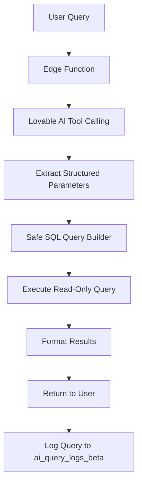

# Natural-Language AI Assistant - Completion Summary

## ✅ Implementation Complete

The AI-powered natural language query interface has been successfully deployed for admin operations.

## What Was Built

### 1. Database Table (Beta Environment)
- **ai_query_logs_beta**: Tracks all AI queries with execution metrics
  - query_text, response_summary, query_type
  - execution_time_ms, success status
  - Complete audit trail

### 2. AI Query Engine
- **Edge Function**: `ai-assistant`
- **Powered by**: Lovable AI (Google Gemini 2.5 Flash)
- **Architecture**: Two-phase AI processing
  1. Natural language → Structured query parameters (tool calling)
  2. Safe SQL execution → Formatted results

### 3. Supported Query Types

#### Top Clients by Revenue
- **Example**: "Show me top clients by revenue this month"
- **Returns**: List of clients sorted by lifetime_revenue with badges

#### PTEs Processed
- **Example**: "How many PTEs did we process last week?"
- **Returns**: Total count with period breakdown

#### Driver Performance
- **Example**: "List drivers with on-time rate below 90%"
- **Returns**: Drivers with calculated on-time percentages

#### Recent Pickups
- **Example**: "Show recent pickups from last 7 days"
- **Returns**: Pickup history with revenue and tire counts

#### Revenue Forecast
- **Example**: "What's the revenue forecast for next quarter?"
- **Returns**: 30/60/90-day projections from revenue_forecasts_beta

#### Client Risk
- **Example**: "Show clients at high risk of churn"
- **Returns**: At-risk clients from client_risk_scores_beta

### 4. User Interface

**Floating Button**
- Fixed bottom-right corner
- Circular button with MessageSquare icon
- Visible on all admin pages

**Chat Drawer**
- Slides in from right side
- "Ask BSG AI" title
- Message history with formatted results
- Query examples for new users
- Clear history button

**Result Formatting**
- Type-specific data visualization
- Badges for metrics
- Truncated lists with "show more"
- Timestamps on all messages

## Security & Permissions

### Role-Based Access
**Allowed Roles:**
- Admin
- Ops Manager
- Sales Manager

**RLS Policies:**
- Only users with allowed roles can view query logs
- Queries scoped to user's organization

### Read-Only Guarantee
- All queries are SELECT-only
- No INSERT, UPDATE, DELETE operations
- Service role executes queries safely
- No raw SQL injection possible

## Query Processing Flow



## Files Created/Modified

### New Files
- `supabase/functions/ai-assistant/index.ts`
- `src/hooks/useAIAssistant.ts`
- `src/components/AIAssistant.tsx`
- `docs/AI_ASSISTANT_COMPLETION.md`

### Modified Files
- `src/App.tsx` (added AIAssistant component globally)

### Database
- Migration: Created `ai_query_logs_beta` table
- RLS policies for admin/ops/sales access only
- Indexes for performance

## Usage

### For Admins
1. Click floating AI button (bottom-right corner)
2. Type natural language query
3. View formatted results in chat
4. Ask follow-up questions
5. Clear history as needed

### Example Queries

**Client Insights:**
- "Who are our top 5 clients?"
- "Show clients at risk of churning"
- "List clients with no pickups this month"

**Performance Metrics:**
- "How many tires did we process today?"
- "Show driver performance for last week"
- "Which drivers need improvement?"

**Financial:**
- "What's our revenue forecast?"
- "Show revenue by client this year"
- "Total revenue last month"

**Operations:**
- "Recent pickups in last 3 days"
- "Show completed manifests this week"
- "List pending pickups"

## Monitoring & Logs

### Check AI Query Activity
```sql
SELECT 
  u.email,
  aql.query_text,
  aql.response_summary,
  aql.query_type,
  aql.execution_time_ms,
  aql.created_at
FROM ai_query_logs_beta aql
JOIN users u ON aql.user_id = u.id
WHERE aql.organization_id = 'YOUR_ORG_ID'
ORDER BY aql.created_at DESC
LIMIT 20;
```

### Performance Metrics
```sql
SELECT 
  query_type,
  COUNT(*) as total_queries,
  AVG(execution_time_ms) as avg_time_ms,
  SUM(CASE WHEN success THEN 1 ELSE 0 END)::FLOAT / COUNT(*) * 100 as success_rate
FROM ai_query_logs_beta
WHERE organization_id = 'YOUR_ORG_ID'
GROUP BY query_type
ORDER BY total_queries DESC;
```

### Recent Errors
```sql
SELECT 
  query_text,
  error_message,
  created_at
FROM ai_query_logs_beta
WHERE success = false
  AND organization_id = 'YOUR_ORG_ID'
ORDER BY created_at DESC
LIMIT 10;
```

## Log Build Completion

Run this SQL to record completion:

```sql
INSERT INTO public.system_updates (
  module_name,
  status,
  notes,
  impacted_tables
) VALUES (
  'ai_assistant_nlq',
  'live',
  'Natural-Language AI Assistant deployed using Lovable AI (Gemini 2.5 Flash). Supports 6 query types with tool-calling architecture for safe parameter extraction. Read-only access to clients, pickups, manifests, revenue_forecasts_beta, driver_performance_beta. Role-restricted to Admin/Ops/Sales. Floating UI button on all admin pages.',
  ARRAY['ai_query_logs_beta']
);
```

## Zero Impact Confirmation

### ✅ Read-Only Access To:
- clients table
- pickups table
- manifests table
- revenue_forecasts_beta
- client_risk_scores_beta
- assignments table (for driver performance)

### ✅ No Changes To:
- Any existing workflows
- Data modification operations
- User permissions (respects existing role-based access)

### ✨ Only Additions:
- New beta table for query logging
- AI assistant edge function
- Floating UI button component
- Natural language query capability

## Architecture Highlights

### Why Tool Calling?
- **Safety**: Prevents SQL injection by using structured parameters
- **Accuracy**: AI extracts intent before query execution
- **Flexibility**: Easy to add new query types
- **Logging**: Clear separation between intent and execution

### Why Lovable AI?
- **Pre-configured**: API key automatically available
- **Fast**: Gemini 2.5 Flash optimized for speed
- **Cost-effective**: No external API setup needed
- **Integrated**: Works seamlessly with Supabase

## Future Enhancements

### Potential Features
- Export results to CSV
- Save favorite queries
- Scheduled reports via AI queries
- Voice input support
- Multi-language support
- Advanced visualizations

### Additional Query Types
- Inventory tracking
- Environmental impact metrics
- Custom date range filtering
- Cross-organizational comparisons (for multi-org users)

## Testing

### Test Queries
1. "Show top 10 clients by revenue"
2. "How many PTEs last week?"
3. "List drivers below 90% on-time"
4. "Recent pickups"
5. "Revenue forecast"
6. "High risk clients"

### Expected Results
- Each query returns formatted data
- Results displayed in chat with proper styling
- Query logged in ai_query_logs_beta
- Execution time < 2 seconds typical

---

**Status**: Natural-Language Interface complete.
**Impact**: Zero changes to existing workflows
**Risk**: Minimal - read-only operations only
**Rollback**: Remove AIAssistant component from App.tsx
